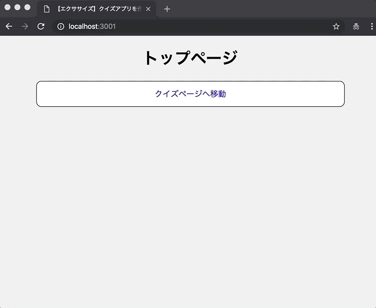

# レポジトリ内容

このレポジトリは[Web白熱教室](https://tsuyopon.xyz/)の[JavaScriptの学習コンテンツ > JavaScriptバックエンド編](https://tsuyopon.xyz/learning-contents/web-dev/javascript/backend/)にある「[【エクササイズ】expressを使ってクイズアプリを作る](https://tsuyopon.xyz/learning-contents/web-dev/javascript/backend/js-excercise-for-backend-6/)」で利用するものです。

### 完成形

## 課題

- 以下の「課題をクリアするためのステップ」の内容を全て対応する
- 対応後、ターミナルで「npm start」を実行してサーバー起動後、完成形と同じような表示をブラウザで確認できるようにする
- クイズアプリの内容は、JavaScriptフロントエンド編の課題である「[【エクササイズ】async/awaitを使ってクイズアプリを作る](https://tsuyopon.xyz/learning-contents/web-dev/javascript/frontend/js-excercise-for-frontend-9/)」と似た内容のものを作る
    - ただし、今回は `htmlファイル` を作らず、expressで生成されたViewを使う

### 課題をクリアするためのステップ

1. [ ] package.jsonを作る
1. [ ] node_modulesをgitのバージョン管理から除外する
1. [ ] 必要なライブラリをインストールする
    - [ ] [express](https://github.com/expressjs/express) を `dependencies` にインストールする
    - [ ] [ejs](https://github.com/mde/ejs) を `dependencies` にインストールする
    - [ ] [nodemon](https://github.com/remy/nodemon) を `devDependencies` にインストールする
1. [ ] package.jsonのscriptsを修正して「npm start」で `nodemon app.js` が実行されるようにする
1. [ ] プロジェクトのルートディレクトリ直下に `app.js` を作成する
1. [ ] プロジェクトのルートディレクトリ直下に `router` ディレクトリを作成する。そして、その後、 `router` ディレクトリ内に `index.js` を実装する
1. [ ] `app.js` の実装内容は以下の通り
    - [ ] `router/index.js` を `require` で読み込む
    - [ ] `router/index.js` を使って `GET /`、 `GET /quiz` にアクセスがあったときに、 `router/index.js` で実装したルーティング処理が実行されるようにする
    - [ ] サーバー起動時のポート番号は `3001` とする
1. [ ] `router/index.js` の実装内容は以下の通り
    - [ ] `router.get('/')` のときは、ブラウザにトップページを表示する(上の画像を参照にする)
    - [ ] `router.get('/quiz')` のときは、ブラウザにクイズページを表示する
    - [ ] `router`を `module.exports` して、外部ファイルから `router` を読み込めるようにする
1. [ ] 静的ファイルの保存用に `public` ディレクトリをプロジェクトのルートディレクトリ直下に作成する
1. [ ] トップページとクイズページ共通で使う `styles.css` を作成する (保存場所は `public/css/styles.css` とする)
    - `styles.css` の内容は「[【エクササイズ】async/awaitを使ってクイズアプリを作る](https://tsuyopon.xyz/learning-contents/web-dev/javascript/frontend/js-excercise-for-frontend-9/)」で作ったものを参考にする
1. [ ] クイズページでのみ使うJavaScriptファイルを作成する (保存場所は `public/js/main.js` とする)
    - `main.js` の内容は「[【エクササイズ】async/awaitを使ってクイズアプリを作る](https://tsuyopon.xyz/learning-contents/web-dev/javascript/frontend/js-excercise-for-frontend-9/)」で作ったものを参考にする
1. [ ] `npm start` でサーバーを起動して、以下の表示がされることを確認する
    - [ ] `localhost:3001` にアクセス → 「トップページです！」とブラウザに表示される
    - [ ] `localhost:3001/quiz` にアクセス → 「アバウトページです！」とブラウザに表示される

## 答え

このレポジトリの `answer` ブランチに答えを用意しているので、そちらを参考にしていただけたらと思います。

## 参考記事

課題をこなしていて、行き詰まったら以下の資料を参考にしていただければ解答にたどり着けるかと思います。

- Web白熱教室
    - [【express】トップページとアバウトページのViewを作成する](https://tsuyopon.xyz/learning-contents/web-dev/javascript/backend/how-to-render-template-files-in-express/)
    - [【express】Viewの共通パーツを作成して各ページで読み込む](https://tsuyopon.xyz/learning-contents/web-dev/javascript/backend/how-to-load-partial-files-in-template-files/)
    - [【express】テンプレートファイルに外からデータを渡す](https://tsuyopon.xyz/learning-contents/web-dev/javascript/backend/how-to-pass-data-to-template-files-in-express/)
    - [【express】テンプレートファイルから静的ファイルを読み込む](https://tsuyopon.xyz/learning-contents/web-dev/javascript/backend/how-to-load-static-files-in-express/)